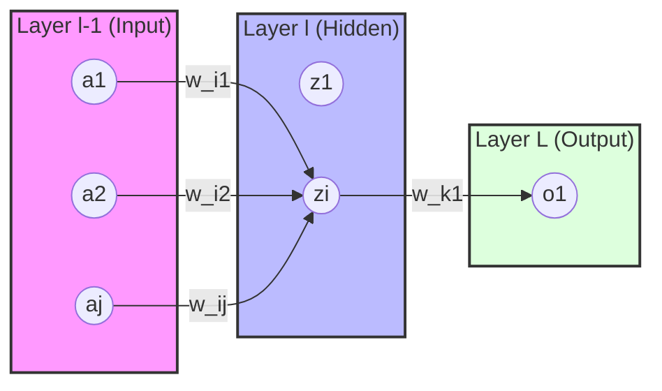

> **Sumber:**
> - [Nature Deep Review](https://www.cs.toronto.edu/~hinton/absps/NatureDeepReview.pdf)
> - [Backpropagation Lecture](https://www.iro.umontreal.ca/~vincentp/ift3395/lectures/backprop_old.pdf)

### Pendahuluan

*Backpropagation* adalah algoritma inti dalam pelatihan jaringan saraf tiruan (artificial neural networks). Algoritma ini memungkinkan kita untuk menghitung gradien dari fungsi loss terhadap setiap *weight* dan *bias* dalam jaringan secara efisien menggunakan aturan rantai (*chain rule*). 

Dalam artikel ini, kita akan menurunkan persamaan matematika di balik *backpropagation* untuk *Multi-Layer Perceptron* (MLP) dengan fokus pada representasi matriks yang sering digunakan dalam implementasi seperti NumPy atau PyTorch.

#### Arsitektur MLP
Berikut adalah visualisasi sederhana dari MLP dengan satu *hidden layer*:



### Notasi Dasar

Kita akan gunakan:

$$
z_i^{(l)} = \left(\sum_j w_{ij}^{(l)} a_j^{(l - 1)}\right) +b_i^{(l)}
$$
Ket:
- $w_{ij}^{(l)}$  : weight neuron ke-$i$ pada layer $l$ dari neuron ke-$j$ pada layer $l - 1$.
- $a_i^{(l)}$  : post-activation neuron ke-$i$ pada layer $l$.
- $z_i^{(l)}$  : pre-activation neuron ke-$i$ pada layer $l$.

Misalkan $\delta^{(l)}_i$ adalah error neuron ke-$i$ pada layer ke-$l$. Error yang dimaksud adalah saat kita melakukan feed-forward pada suatu layer tertentu, setiap neuron akan melakukan operasi neuron $\sigma{(z^{(l)}_i)}$

Alih-alih kita melakukan operasi tersebut langsung, kita dapat menambahkan gangguan $\Delta z^{(l)}_i$ saat melakukan operasi neuron menjadi $\sigma{(z^{(l)}_i + \Delta z^{(l)}_i)}$. Perubahan ini mempengaruhi nilai loss function. Tujuannya untuk meminimalkan loss function.
Secara matematis hubungan antara gangguan dan loss yaitu:

$$
\begin{align*}
\dfrac{\Delta C}{\Delta z^{(l)}_i} &\approx \dfrac{\partial C}{\partial z^{(l)}_i} \\
\Delta C &\approx \dfrac{\partial C}{\partial z^{(l)}_i} \Delta z^{(l)}_i
\end{align*}
$$

Karena $\Delta z^{(l)}_i \approx \partial z^{(l)}_i$ berarti perubahan kecil terhadap $z^{(l)}_i$. Kita akan mendefinisikan $\delta^{(l)}_i$ sebagai error atau hubungan antara gangguan ($\Delta z^{(l)}_i$) dan loss yaitu:

$$
\delta^{(l)}_i = \dfrac{\partial C}{\partial z^{(l)}_i}
$$
> Kenapa kita tidak mendefinisikan $\delta^{(l)}_i$ sebagai error pada post-activation $\dfrac{\partial C}{\partial a^{(l)}_i}$ saja?

Sebenarnya bisa saja kita definisikan seperti itu, namun akan menjadi lebih kompleks dan kurang elegan secara matematis. Jadi, kita akan gunakan $$\boxed{\delta^{(l)}_i = \dfrac{\partial C}{\partial z^{(l)}_i}}$$sebagai error neuron ke-$i$ pada layer ke-$l$.
#### Output Layer
Definisikan $\delta^{(L)}_i$ sebagai error neuron ke-$i$ pada layer output yaitu:

$$
\begin{eqnarray} 
  \delta^{(L)}_i = \frac{\partial C}{\partial a^{(L)}_i} \sigma'(z^{(L)}_i)
\tag{BP1}
\end{eqnarray}
$$

**Bukti.**
Sebelumnya kita tahu telah mendefinisikan:

$$
\delta^{(L)}_i = \dfrac{\partial C}{\partial z_i^{(L)}}
$$

Dengan menggunakan aturan rantai:

$$
\delta^{(L)}_i = \sum_k \dfrac{\partial C}{\partial a_k^{(L)}}\dfrac{\partial a_k^{(L)}}{\partial z_i^{(L)}} = \dfrac{\partial C}{\partial a_i^{(L)}}\dfrac{\partial a_i^{(L)}}{\partial z_i^{(L)}} + \underbrace{\sum_{k \neq i} \dfrac{\partial C}{\partial a_k^{(L)}}\dfrac{\partial a_k^{(L)}}{\partial z_i^{(L)}}}_{0}
$$

Penjumlahan ada karena cost function tidak hanya bergantung pada neuron ke-$i$ saja, namun bergantung pada seluruh neuron pada layer tersebut. Sehingga kita harus mempertimbangkan setiap $a_k^{(L)}$. Aktivasi neuron ke-$k$ ($a_k^{(L)}$) **hanya bergantung** pada $z_k^{(L)}$ ketika $k = i$. Namun, neuron-neuron lain ($k \neq i$) tidak terpengaruh. Persamaan di atas menjadi:

$$
\delta^{(L)}_i = \dfrac{\partial C}{\partial a_i^{(L)}} \dfrac{\partial a_i^{(L)}}{\partial z_i^{(L)}} 
$$

Karena $a_i^{(L)} = \sigma{(z_i^{(L)})}$ sehingga $\dfrac{\partial a_i^{(L)}}{\partial z_i^{(L)}} = \sigma'{(z_i^{(L)})}$.

$$
\delta^{(L)}_i = \dfrac{\partial C}{\partial a_i^{(L)}} \sigma'{(z_i^{(L)})} \qquad \qquad Terbukti.
$$
Rumus di atas hanya berlaku untuk fungsi sigmoid karena asumsi $a_i^{(L)}$ hanya bergantung pada $z_i^{(L)}$ (lokal) sedangkan pada softmax, perubahan nilai $z_i^{(L)}$ dapat mengubah nilai seluruh $a_{i}^{(L)}$ (global).

Sehingga untuk softmax, kita akan mempertimbangkan seluruh $a_k^{(L)}$:

$$
\delta^{(L)}_i = \dfrac{\partial C}{\partial a_i^{(L)}}\dfrac{\partial a_i^{(L)}}{\partial z_i^{(L)}} + \sum_{k \neq i} \dfrac{\partial C}{\partial a_k^{(L)}}\dfrac{\partial a_k^{(L)}}{\partial z_i^{(L)}}
$$

Selanjutnya kita akan gunakan categorical cross entropy loss untuk mencari error pada layer $L$:

$$
C(\mathbf{a}^{(L)}, \mathbf{y}) = - \sum_k y_k \log(a^{(L)}_k)
$$
Untuk $\dfrac{\partial C}{\partial a_i^{(L)}}$,

$$
\begin{align*}
\dfrac{\partial C}{\partial a_i^{(L)}} &= \dfrac{\partial}{\partial a_i^{(L)}}(-y_i \log(a^{(L)}_i)) \\
&= -y_i \cdot \dfrac{1}{a_i^{(L)}} \\
&= -\dfrac{y_i}{a_i^{(L)}}
\end{align*}
$$

Untuk $\dfrac{\partial a_i^{(L)}}{\partial z_i^{(L)}}$,

$$
\begin{align*}
\dfrac{\partial a_i^{(L)}}{\partial z_i^{(L)}} &= \dfrac{\partial}{\partial z_i^{(L)}} \left(\dfrac{e^{z_{i}^{(L)}}}{\sum_{j}e^{z_{j}^{(L)}}}\right) \\
&= \dfrac{(e^{z_i^{(L)}})\left(\sum_{j}e^{z_{j}^{(L)}}\right)- e^{z_i^{(L)}}e^{z_i^{(L)}}}{\left(\sum_{j}e^{z_{j}^{(L)}}\right)^2} \\
&= \dfrac{e^{z_i^{(L)}}}{\sum_{j}e^{z_{j}^{(L)}}} - \left(\dfrac{ e^{z_i^{(L)}}}{\sum_{j}e^{z_{j}^{(L)}}}\right)^2 \\
&= a_i^{(L)} -\left(a_i^{(L)}\right)^2 \\
&= a_i^{(L)}\left(1 - a_i^{(L)}\right)
\end{align*} 
$$

Untuk $\dfrac{\partial C}{\partial a_k^{(L)}}$,

$$
\begin{align*}
\dfrac{\partial C}{\partial a_k^{(L)}} &= \dfrac{\partial}{\partial a_k^{(L)}}(-y_k\log(a^{(L)}_k)) \\
&= -y_k \cdot \dfrac{1}{a_k^{(L)}} \\
&= -\dfrac{y_k}{a_k^{(L)}}
\end{align*}
$$

Untuk $\dfrac{\partial a_k^{(L)}}{\partial z_i^{(L)}}$,

$$
\begin{align*}
\dfrac{\partial a_k^{(L)}}{\partial z_i^{(L)}} &= \dfrac{\partial}{\partial z_i^{(L)}} \left(\dfrac{e^{z_{k}^{(L)}}}{\sum_{j}e^{z_{j}^{(L)}}}\right) \\
&= \dfrac{0 - e^{z_k^{(L)}}e^{z_i^{(L)}}}{\left(\sum_{j}e^{z_{j}^{(L)}}}\right)^2} \\
&= -a_k^{(L)}a_i^{(L)}
\end{align*}
$$

Sehingga menjadi:

$$
\begin{align*}
\delta^{(L)}_i &= \dfrac{\partial C}{\partial a_i^{(L)}}\dfrac{\partial a_i^{(L)}}{\partial z_i^{(L)}} + \sum_{k \neq i} \dfrac{\partial C}{\partial a_k^{(L)}}\dfrac{\partial a_k^{(L)}}{\partial z_i^{(L)}} \\
&= -\dfrac{y_i}{\cancel{a_i^{(L)}}} \cancel{a_i^{(L)}}\left(1 - a_i^{(L)}\right) + \sum_{k \neq i} \left(-\dfrac{y_k}{\cancel{a_k^{(L)}}}\right)\left(-\cancel{a_k^{(L)}}a_i^{(L)}\right) \\
&= -y_i \left(1 - a_i^{(L)}\right) + \sum_{k \neq i} y_k a_i^{(L)} \\
&= -y_i + y_ia_i^{(L)} + a_i^{(L)}\sum_{k \neq i} y_k \\
&= -y_i + a_i^{(L)}\underbrace{\left(y_i + \sum_{k \neq i} y_k\right)}_{1} \\
&= a_i^{(L)} - y_i
\end{align*}
$$
Dalam bentuk matriks yaitu
$$
\begin{align*}
\delta_i^{(L)} &\longrightarrow \delta^{(L)} \in \mathbb{R}^{n_{L} \times 1} \\
a_i^{(L)} &\longrightarrow \mathbf{a}^{(L)} \in \mathbb{R}^{n_{L} \times 1} \\
y_i &\longrightarrow \mathbf{y} \in \mathbb{R}^{n_{L} \times 1}
\end{align*}
$$
Sehingga menjadi:

$$
\delta^{L} = \mathbf{a}^{(L)} - \mathbf{y}
$$
Selanjutnya, definisikan $\dfrac{\partial C}{\partial b_i^{(l)}}$ sebagai:

$$
\dfrac{\partial C}{\partial b_i^{(l)}} = \delta_i^{(l)}
$$

> Hal ini terpenuhi untuk seluruh neuron pada setiap layer.

**Bukti.**
Perhatikan bahwa 
$$
\begin{align*}
\dfrac{\partial C}{\partial b_i^{(l)}} &= \underbrace{\dfrac{\partial C}{\partial z_i^{(l)}}}_{\delta_i^{(l)}} \cdot\underbrace{\dfrac{\partial z_i^{(l)}}{\partial b_i^{(l)}}}_{1} \\
&= \delta_i^{(l)}
\end{align*}
$$
Dalam bentuk matriks yaitu,
$$
\begin{align*}
\dfrac{\partial C}{\partial b_i^{(l)}} &\longrightarrow \dfrac{\partial C}{\partial \mathbf{b}^{(l)}} \in \mathbb{R}^{n_l \times 1} \\
\delta_i^{(l)} &\longrightarrow \delta^{(l)} \in \mathbb{R}^{n_l \times 1}
\end{align*}
$$
Sehingga,
$$
\dfrac{\partial C}{\partial \mathbf{b}^{(l)}} = \delta^{(l)}
$$
Selanjutnya, definisikan $\dfrac{\partial C}{\partial w_{ij}^{(l)}}$ sebagai:

$$
\dfrac{\partial C}{\partial w_{ik}^{(l)}} = \delta_i^{(l)} a_k^{(l - 1)}
$$

> Hal ini terpenuhi untuk seluruh neuron pada setiap layer.

**Bukti.**
Perhatikan bahwa
$$
\begin{align*}
\dfrac{\partial C}{\partial w_{ik}^{(l)}} &= \underbrace{\dfrac{\partial C}{\partial z_i^{(l)}}}_{\delta_i^{(l)}} \cdot\underbrace{\dfrac{\partial z_i^{(l)}}{\partial w_{ik}^{(l)}}}_{a_{k}^{(l - 1)}} \\
&= \delta_i^{(l)}a_{k}^{(l - 1)}
\end{align*}
$$
Dalam bentuk matriks yaitu
$$
\begin{align*}
\dfrac{\partial C}{\partial w_{ij}^{(l)}} &\longrightarrow \dfrac{\partial C}{\partial \mathbf{W}^{(l)}} \in \mathbb{R}^{n_l \times n_{l - 1}} \\
\delta_i^{(l)} &\longrightarrow \delta^{(l)} \in \mathbb{R}^{n_l \times 1} \\
a_k^{(l - 1)} &\longrightarrow \mathbf{a}^{(l - 1)} \in \mathbb{R}^{n_{l -1} \times 1}
\end{align*}
$$
Sehingga menjadi, 
$$
\dfrac{\partial C}{\partial \mathbf{W}^{(l)}} = \delta^{(l)} \left(\mathbf{a}^{(l - 1)}\right)^{\intercal}
$$
Definisikan $\delta_i^{(l)}$ sebagai error neuron ke-$i$ pada layer hidden dengan $l = L-1,L-2,\dots, 2$ dan $k$ adalah neuron ke-$k$ pada layer $l + 1$:

$$
\begin{eqnarray} 
  \delta^{(l)}_i = \sum_k w^{(l+1)}_{ki}  \delta^{(l+1)}_k \sigma'(z^{(l)}_i)
\tag{BP2}
\end{eqnarray}
$$
**Bukti.**
Kita tahu bahwa
$$
\begin{align*}
\delta_i^{(l)} &= \dfrac{\partial C}{\partial z_i^{(l)}} \\
\end{align*}
$$
Untuk menghitung error pada layer ke-$l$, kita harus menghitung error layer setelahnya ($l + 1$) (aturan rantai).
$$
\begin{align*}
\delta_i^{(l)} &= \dfrac{\partial C}{\partial z_i^{(l)}} \\
&= \sum_k \underbrace{\dfrac{\partial C}{\partial z_k^{(l + 1)}}}_{\delta_i^{(l + 1)}} \dfrac{\partial z_k^{(l + 1)}}{\partial z_i^{(l)}} \\
&= \sum_k \dfrac{\partial z_k^{(l + 1)}}{\partial z_i^{(l)}}\delta_i^{(l + 1)}
\end{align*}
$$
Karena $\displaystyle z_k^{(l + 1)} = \left(\sum_{j} w_{kj}^{(l + 1)}a_j^{(l)}\right) + b_k^{(l + 1)}$ Untuk $\dfrac{\partial z_k^{(l + 1)}}{\partial z_i^{(l)}}$ ,
$$
\begin{align*}
\dfrac{\partial z_k^{(l + 1)}}{\partial z_i^{(l)}} &= \dfrac{\partial}{\partial z_i^{(l)}} \displaystyle \left(\left(\sum_{j} w_{kj}^{(l + 1)}a_j^{(l)}\right) + b_k^{(l + 1)}\right) \\
&= \dfrac{\partial}{\partial z_i^{(l)}} \displaystyle \left(\left(\sum_{j} w_{kj}^{(l + 1)}\sigma(z_j^{(l)})\right) + b_k^{(l + 1)}\right) \qquad (\text{subs }a_{j}^{(l)} = \sigma(z_j^{(l)})) \\
&= w_{ki}^{(l + 1)}\sigma'(z_i^{(l)})
\end{align*}
$$
Substitusi ke persamaan sebelumnya
$$
\begin{align*}
\delta_i^{(l)} &= \sum_k \dfrac{\partial z_k^{(l + 1)}}{\partial z_i^{(l)}}\delta_i^{(l + 1)} \\
&= \sum_k w_{ki}^{(l + 1)}\delta_i^{(l + 1)} \sigma'(z_i^{(l)})
\end{align*}
$$
Dalam bentuk matriks, kita harus menyamakan dimensinya,
$$
\begin{align*}
\delta_i^{(l)} &\longrightarrow \delta^{(l)} \in \mathbb{R}^{n_{l} \times 1} \\
w_{ki}^{(l + 1)} &\longrightarrow \mathbf{W}^{(l + 1)} \in \mathbb{R}^{n_{l + 1} \times n_{l}} \\
\delta_i^{(l + 1)} &\longrightarrow \delta^{(l + 1)} \in \mathbb{R}^{n_{l + 1} \times 1} \\
\sigma'(z_i^{(l)}) &\longrightarrow \sigma'(\mathbf{z}^{(l)}) \in \mathbb{R}^{n_{l}\times 1}  
\end{align*}
$$
Sehingga menjadi
$$
\delta^{(l)} = ((\mathbf{W}^{(l + 1)})^{\intercal} \delta^{(l + 1)})\odot \sigma'(\mathbf{z}^{(l)})
$$

### Ringkasan Empat Persamaan Dasar

Secara ringkas, backpropagation dapat diringkas menjadi empat persamaan utama (dalam bentuk matriks/vektor):

1.  **Error pada output layer**: $\delta^{(L)} = \nabla_a C \odot \sigma'(z^{(L)})$
2.  **Error pada hidden layer**: $\delta^{(l)} = ((W^{(l+1)})^T \delta^{(l+1)}) \odot \sigma'(z^{(l)})$
3.  **Laju perubahan bias**: $\frac{\partial C}{\partial b^{(l)}} = \delta^{(l)}$
4.  **Laju perubahan weight**: $\frac{\partial C}{\partial w^{(l)}} = \delta^{(l)} (a^{(l-1)})^T$

---

### Implementasi NumPy

Berikut adalah cuplikan kode sederhana menggunakan NumPy untuk mengimplementasikan *backpropagation* berdasarkan derivasi di atas:

```python
import numpy as np

def sigmoid(z):
    return 1.0 / (1.0 + np.exp(-z))

def sigmoid_prime(z):
    return sigmoid(z) * (1 - sigmoid(z))

def backprop(x, y, weights, biases):
    # 1. Feed-forward
    activations = [x]
    zs = []
    a = x
    for w, b in zip(weights, biases):
        z = np.dot(w, a) + b
        zs.append(z)
        a = sigmoid(z)
        activations.append(a)
    
    # 2. Backward pass
    # Hitung delta L (Output layer error)
    delta = (activations[-1] - y) # Asumsi MSE + Linear atau Cross-Entropy + Softmax
    
    del_w = [np.dot(delta, activations[-2].T)]
    del_b = [delta]
    
    # Loop back through layers (Hidden layers)
    for l in range(2, len(weights) + 1):
        z = zs[-l]
        sp = sigmoid_prime(z)
        delta = np.dot(weights[-l+1].T, delta) * sp
        del_b.insert(0, delta)
        del_w.insert(0, np.dot(delta, activations[-l-1].T))
        
    return del_w, del_b
```

Semoga penjelasan ini membantumu memahami "sihir" di balik pelatihan jaringan saraf!
